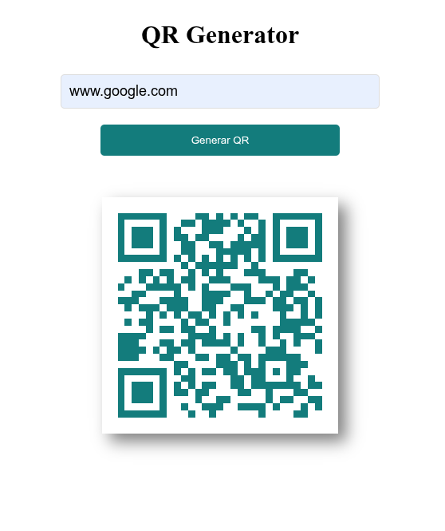

# QR Generator  

Genera códigos **QR** de manera rápida, sencilla y completamente libre.  
Este proyecto fue creado con el objetivo de facilitar la generación de QR para cualquier sitio web sin restricciones, de forma intuitiva y accesible desde cualquier dispositivo.  

🔗 ***Prueba la aplicación en línea aquí:***  
👉 [QR Generator - Demo](https://ingleonardo.github.io/QRgenerator/)  

---

## ✨ Características  
- Genera códigos QR a partir de cualquier enlace web.  
- Interfaz simple y amigable.  
- 100% gratuito y sin limitaciones.  
- Compatible con navegadores modernos y dispositivos móviles.  

---

## 🚀 ¿Cómo usarlo?  
1. Ingresa al enlace de la demo.  
2. Escribe o pega la URL del sitio que quieras convertir en QR.  
3. Haz clic en **Generar QR**.  
4. Descarga o escanea el código generado para compartirlo fácilmente.  

---

## 🏜️ Vista previa  

  

---

## 🛠️ Tecnologías utilizadas  
- **HTML5**  
- **CSS3**  
- **JavaScript**  

